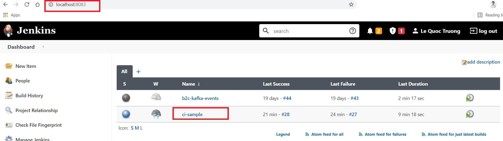
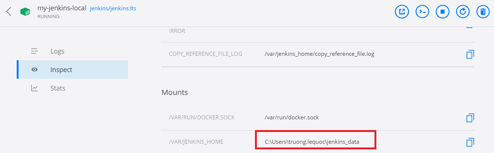
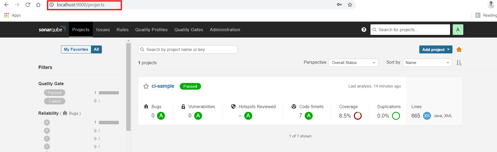
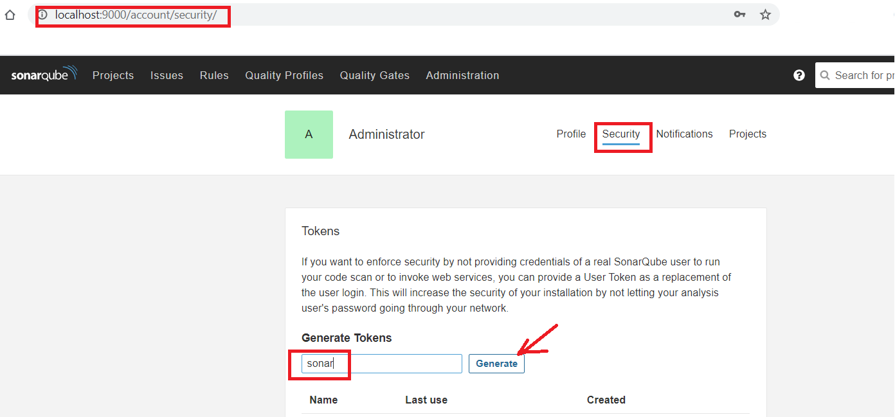
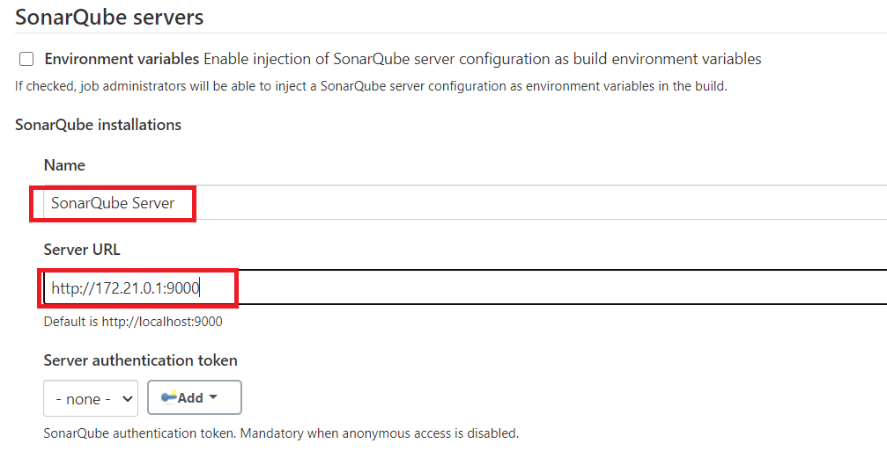
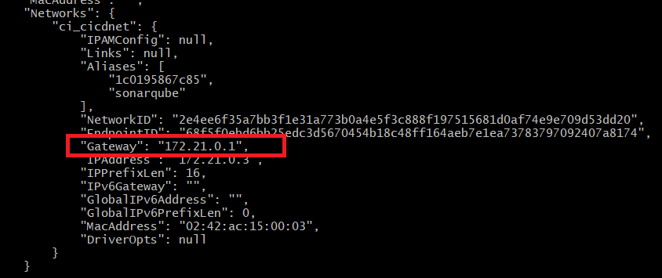
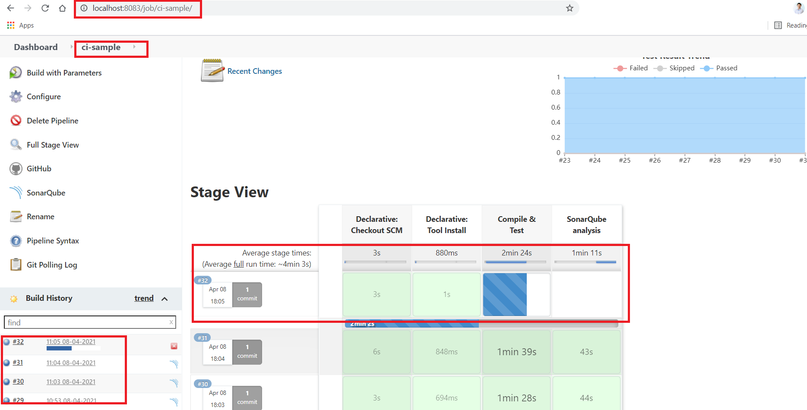
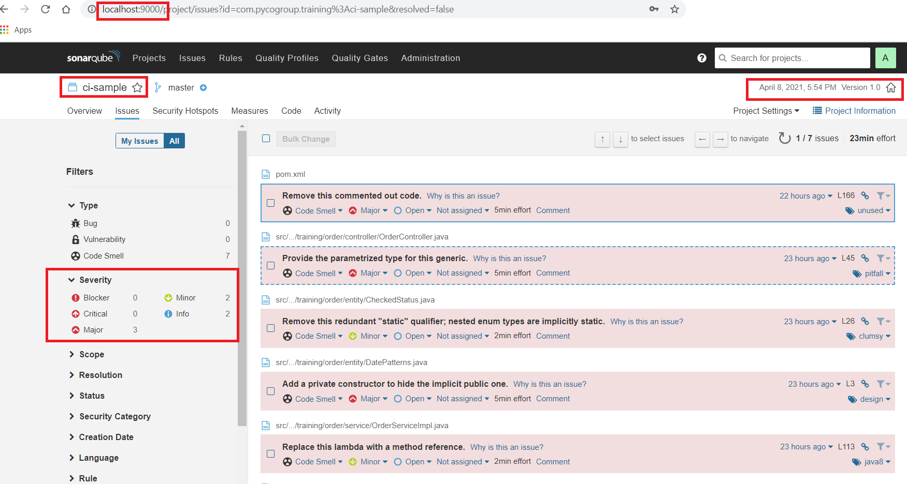

# Install local Jenkins + SONAR

Continuous Integration &amp; Development (CI/CD) with Jenkins Pipeline for Spring Boot projects

## Install Jenkins
Start Jenkins using docker by below command

```
docker-compose -f jenkins.yml up
```

Check the host running at: `http://localhost:8083`



Docker start with Jenkins container path storage info: /var/jenkins_home

Change Jenkins Admin Password if forgot

	cat var/jenkins_home/users/users.xml
	vim var/jenkins_home/users/truong_5246216019566647562/config.xml

Edit `config.xml` file for corresponding user by updating the encrypting password. Save the `config.xml` file.

We can install module `vim` on linux by

```
apt-get update
apt-get install vim
```

Or if we use Docker running on WinOS, we can open Jenkins docker container and check the according `mounted` path
and go to change the password there. After that, we restart Jenkins server



Docker find path mounted to HOST: `C:\Users\truong.lequoc\jenkins_data\`

[comment]: <> (Jenkins Login: truong/123456)

[comment]: <> (SONAR login: admin/admin)

## Install SONAR
Start SONAR using docker by below command

```
docker-compose -f sonar.yml up
```

Check the host running at: `http://localhost:9000`



# Configure Jenkins to connected to SONAR
- add tools SONARQUBE Scanner, Git, JUnit, Maven, JDK11 in Jenkins Server: (e.g. **Manage Jenkins > Global Tool
  Configuration)
- add plugins Checks API in Jenkins Server (e.g. **Manage Jenkins > Manage Plugins > Checks API**)
- Go to SONAR and generate Token to access from Jenkins
  
- Configure SonarQube Server in **Manage Jenkins > Configure System > SonarQube Servers**



Since SONAR is running on Docker as well, different containers from Jenkins. Thus, we have to access to public IP of
SONAR. To find this IP (e.g. 172.21.0.1), we inspect SONAR container

```	
 docker inspect <sonar container id>
```
The result as shown below


# Jenkins Pipeline
Create a project (e.g. ci-sample) using Spring Boot and create the `Jenkinsfile` at the root folder

- Spring Boot Java project using Maven and include `Jacoco` plugin for code coverage report. See it in [pom file](pom.xml)
- [Jenkinsfile](Jenkinsfile) to define Pipeline
- Create a Jenkins job (e.g. ci-sample) in Jenkins Server

# Troubleshoots
```
[Checks API] No suitable checks publisher found
```

For this issue, we have to install plugin `Checks API` in Manage Jenkins > Manage Plugins > Checks API

# Results
Jenkins Pipeline jobs are triggered for every time the Git has changes.

SONAR report will be published after Jenkins job build & test run passed.
